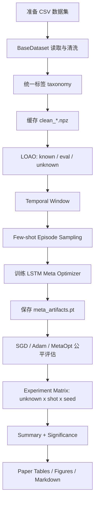
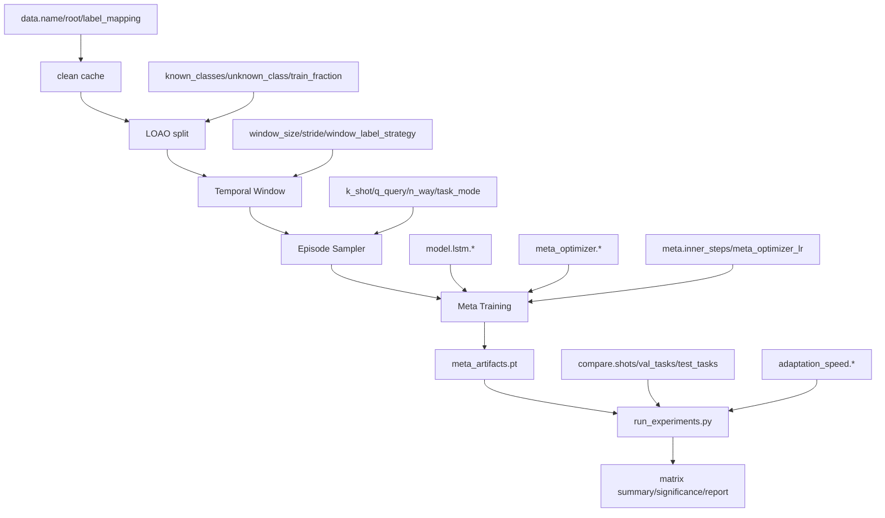

# LSTM + Meta Optimizer + Few-shot NIDS 实验运行手册

本文档是本项目长期维护的可复现实验手册。目标是让新成员从零开始完成：

- 环境检查与依赖安装；
- 数据集放置与验证；
- 自动数据清洗、LOAO 划分、Temporal Window 构建；
- Meta Optimizer 训练；
- SGD / Adam / MetaOpt 公平评估；
- 多 Unknown、多 Shot、多 Seed 论文实验矩阵；
- 统计显著性、绘图、论文表格和中文实验章节生成。

当前项目只有一个训练入口 `train_meta.py`。仓库中不存在 `train.py` 和 `evaluate.py`；评估入口是 `scripts/run_experiments.py`，论文矩阵入口是 `scripts/run_fast_adaptation_matrix.py`。

---

## 1. 项目完整运行流程



| 步骤 | 输入 | 输出 | 对应代码 |
| --- | --- | --- | --- |
| 数据准备 | 原始 CSV | `datasets/<DATASET>/.../*.csv` | 手动放置 |
| 数据读取清洗 | CSV、`configs/datasets/*.yaml` | 标准化 DataFrame | `src/data/base_dataset.py` |
| 标签规范化 | 原始标签列 | `label` 统一类别 | `src/data/cicids2017.py`、`src/data/unsw_nb15.py` 等 |
| 缓存 | 清洗结果 | `outputs/cache/<dataset>/clean_*.npz` | `src/data/pipeline.py` |
| LOAO 划分 | known/unknown 配置 | train/eval/test/unknown split | `src/data/loao.py` |
| Window 构建 | Flow 特征序列 | `[N, window_size, feature_dim]` | `src/data/windowing.py` |
| Episode 采样 | Window Dataset | support/query task | `src/data/task_sampler.py`、`src/data/task_builder.py` |
| Meta 训练 | episode、随机 LSTM、MetaOpt | `meta_artifacts.pt`、`best.pt`、`last.pt` | `train_meta.py` |
| 单 artifact 评估 | `meta_artifacts.pt` | `results.json`、CSV、曲线图 | `scripts/run_experiments.py` |
| 论文矩阵 | unknown x shot x seed | `matrix_results.csv`、summary、significance | `scripts/run_fast_adaptation_matrix.py` |
| 论文报告 | matrix 输出 | tables、figures、`experiment_section.md` | `scripts/generate_paper_report.py` |

任务定义固定为：

```text
输入: 连续历史 Flow Window = [flow_{t-L+1}, ..., flow_t]
输出: 窗口最后一个 Flow 的攻击类别 label(flow_t)
```

这不是 Future Prediction，也不是 Next Flow Prediction。

---

## 2. 从零开始的完整命令

以下命令默认在项目根目录执行：

```powershell
cd E:\Progect\MetaLearning
```

### Step 1: 环境检查

```powershell
python --version
python -c "import sys, torch; print('python', sys.version.split()[0]); print('torch', torch.__version__); print('cuda_available', torch.cuda.is_available()); print('cuda', torch.version.cuda)"
```

当前已验证环境示例：

```text
Python 3.12.2
torch 2.12.0+cpu
cuda_available False
```

安装依赖：

```powershell
python -m pip install -r requirements.txt
```

如果使用 CUDA，请先安装匹配 CUDA 的 PyTorch，再安装其余依赖。例如：

```powershell
python -m pip install torch --index-url https://download.pytorch.org/whl/cu121
python -m pip install -r requirements.txt
```

运行测试：

```powershell
python -m pytest tests -q
```

期望：所有测试通过。

### Step 2: 准备数据集

项目支持的数据集注册名：

| 配置文件 | `data.name` | 默认目录 |
| --- | --- | --- |
| `configs/datasets/cicids2017.yaml` | `cicids2017` | `datasets/CICIDS2017` |
| `configs/datasets/cse_cic_ids2018.yaml` | `cse_cic_ids2018` | `datasets/CSE_CIC_IDS2018` |
| `configs/datasets/unsw_nb15.yaml` | `unsw_nb15` | `datasets/UNSW_NB15` |
| `configs/datasets/cicddos2019.yaml` | `cicddos2019` | `datasets/CICDDoS2019` |

CICIDS2017 当前目录结构示例：

```text
datasets/CICIDS2017/
  Friday-WorkingHours-Afternoon-DDos.pcap_ISCX.csv
  Friday-WorkingHours-Afternoon-PortScan.pcap_ISCX.csv
  Friday-WorkingHours-Morning.pcap_ISCX.csv
  Monday-WorkingHours.pcap_ISCX.csv
  Thursday-WorkingHours-Afternoon-Infilteration.pcap_ISCX.csv
  Thursday-WorkingHours-Morning-WebAttacks.pcap_ISCX.csv
  Tuesday-WorkingHours.pcap_ISCX.csv
  Wednesday-workingHours.pcap_ISCX.csv
```

验证 CSV 是否可被发现：

```powershell
Get-ChildItem -Recurse datasets\CICIDS2017 -Filter *.csv | Measure-Object
Get-ChildItem -Recurse datasets\CICIDS2017 -Filter *.csv | Select-Object -First 10 FullName
```

### Step 3: 数据预处理与缓存

本项目没有单独的预处理脚本。预处理由 `build_pipeline()` 在训练或评估时自动触发，包括：

- 递归发现 CSV；
- 删除重复列、全空列；
- 选择数值特征；
- `Inf -> NaN`；
- NaN 中位数填补；
- 统一标签；
- 去重样本；
- StandardScaler；
- LOAO 划分；
- Temporal Window；
- support/query episode 采样器构建。

单独触发一次数据管线并生成缓存：

```powershell
python -c "from src.utils.config import load_config; from src.data.pipeline import build_pipeline; cfg=load_config('configs/base.yaml').merge(load_config('configs/datasets/cicids2017.yaml').to_dict()); build_pipeline(cfg, seed=int(cfg.experiment.seed))"
```

输出：

```text
outputs/cache/cicids2017/clean_<hash>.npz
```

如果修改 `data.root` 或 `data.label_mapping`，缓存 key 会变化并重新生成。若修改 `window_size`、`stride`、`known_classes`、`unknown_class`，清洗缓存通常可复用，但 window / LOAO / episode 会在运行时重新构建。

### Step 4: 训练 Meta Optimizer

正式训练默认 CICIDS2017：

```powershell
python train_meta.py --config configs/base.yaml --dataset configs/datasets/cicids2017.yaml --out checkpoints/meta_artifacts.pt
```

输入：

- `configs/base.yaml`
- `configs/datasets/cicids2017.yaml`
- `datasets/CICIDS2017/**/*.csv`

输出：

```text
checkpoints/meta_artifacts.pt
checkpoints/best.pt
checkpoints/last.pt
outputs/figures/meta_curves.png
logs/tensorboard/
```

参数说明：

| 参数 | 默认值 | 作用 | 什么时候修改 |
| --- | --- | --- | --- |
| `--config` | `configs/base.yaml` | 主配置 | 基本不改 |
| `--dataset` | `configs/datasets/cicids2017.yaml` | 数据集覆盖配置 | 更换数据集时修改 |
| `--out` | `checkpoints/meta_artifacts.pt` | 公平评估用 artifact | 多实验并行时必须改，避免覆盖 |
| `--override` | `[]` | 命令行覆盖配置 | 做 ablation 或快速 smoke 时使用 |

快速 smoke 训练：

```powershell
python train_meta.py --config configs/base.yaml --dataset configs/datasets/cicids2017.yaml --out outputs/smoke_meta_artifacts.pt --override train.meta_epochs=1 data.tasks_per_epoch=2 data.meta_batch_size=1 train.eval_tasks=1 train.log_interval=1 train.early_stopping.enabled=false train.tensorboard.enabled=false data.k_shot=1 data.q_query=1 data.max_per_class=500
```

### Step 5: 继续训练 / Resume

当前项目没有 `--resume` 参数。`checkpoints/best.pt` 和 `checkpoints/last.pt` 会保存训练状态，但 `train_meta.py` 没有加载它们继续训练的入口。

当前可复用方式：

- 用 `checkpoints/meta_artifacts.pt` 做评估；
- 用矩阵脚本的 `--skip-existing` 跳过已经完成的 artifact；
- 如果改变训练预算或模型配置，需要重新运行 `train_meta.py`。

矩阵实验断点续跑：

```powershell
python scripts/run_fast_adaptation_matrix.py --unknowns all --shots 1,3,5,10 --seeds 42,52,62,72,82 --train-horizons 20 --eval-steps 20 --skip-existing
```

### Step 6: 单 artifact 评估

```powershell
python scripts/run_experiments.py --artifacts checkpoints/meta_artifacts.pt --out outputs/experiments
```

输入：

- `checkpoints/meta_artifacts.pt`
- artifact 内保存的配置；
- 当前数据集缓存/CSV；
- 可选 `--override`

输出：

```text
outputs/experiments/results.json
outputs/experiments/fixed_budget_results.csv
outputs/experiments/task_level_results.csv
outputs/experiments/adaptation_curves.csv
outputs/experiments/update_analysis.csv
outputs/experiments/layer_update_distribution.csv
outputs/experiments/gradient_evolution.csv
outputs/experiments/*_confusion.png
outputs/experiments/*_f1_vs_step.png
outputs/experiments/*_speed_bars.png
```

注意：`run_experiments.py` 会检查 artifact 与当前配置是否一致：

- `unknown_class` 必须一致；
- `meta.inner_steps` 必须一致；
- `data.train_fraction` 必须一致。

### Step 7: 运行论文实验矩阵

快速 dry-run，只打印命令：

```powershell
python scripts/run_fast_adaptation_matrix.py --quick --dry-run
```

快速端到端 smoke：

```powershell
python scripts/run_fast_adaptation_matrix.py --quick --unknowns configured --shots 1,3 --seeds 42 --train-horizons 2 --eval-steps 2 --out outputs/smoke_fast_matrix --override train.meta_epochs=1 data.tasks_per_epoch=1 data.meta_batch_size=1 train.eval_tasks=1 train.log_interval=1 train.early_stopping.enabled=false train.tensorboard.enabled=false compare.val_tasks=1 compare.test_tasks=1 data.k_shot=1 data.q_query=1 data.max_per_class=500 data.disallow_support_query_overlap=false adaptation_speed.checkpoints=[0,1,2]
```

说明：上面的 smoke 为了极小数据可运行，关闭了 `data.disallow_support_query_overlap=false`。正式实验不要关闭。

正式论文矩阵：

```powershell
python scripts/run_fast_adaptation_matrix.py --config configs/base.yaml --dataset configs/datasets/cicids2017.yaml --out outputs/fast_adaptation_matrix --unknowns all --shots 1,3,5,10 --seeds 42,52,62,72,82 --train-horizons 20 --eval-steps 20
```

如果还要分析不同训练 horizon：

```powershell
python scripts/run_fast_adaptation_matrix.py --config configs/base.yaml --dataset configs/datasets/cicids2017.yaml --out outputs/fast_adaptation_matrix_horizon --unknowns all --shots 1,3,5,10 --seeds 42,52,62,72,82 --train-horizons 5,10,20 --eval-steps 20
```

矩阵输出：

```text
outputs/fast_adaptation_matrix/matrix_results.csv
outputs/fast_adaptation_matrix/matrix_results.json
outputs/fast_adaptation_matrix/summary/matrix_results.csv
outputs/fast_adaptation_matrix/significance/matrix_results.csv
outputs/fast_adaptation_matrix/update_analysis/matrix_results.csv
outputs/fast_adaptation_matrix/runs/<unknown>/fraction_<f>/seed_<seed>/horizon_<h>/meta_artifacts.pt
outputs/fast_adaptation_matrix/runs/<unknown>/fraction_<f>/seed_<seed>/horizon_<h>/evaluation/
```

### Step 8: 生成论文结果

```powershell
python scripts/generate_paper_report.py --input outputs/fast_adaptation_matrix --out outputs/paper_report
```

输出：

```text
outputs/paper_report/paper_tables/fewshot_performance.csv
outputs/paper_report/paper_tables/adaptation_speed.csv
outputs/paper_report/paper_tables/significance_macro_f1.csv
outputs/paper_report/paper_figures/*.png
outputs/paper_report/experiment_section.md
```

---

## 3. 配置参数总表

### 3.1 `experiment`

| 参数 | 默认值 | 含义 | 建议范围 | 影响 | 是否建议修改 |
| --- | --- | --- | --- | --- | --- |
| `experiment.name` | `lstm_metaopt_fewshot_ids` | 实验名 | 字符串 | 日志识别 | 可选 |
| `experiment.seed` | `42` | 随机种子 | 42/52/62/72/82 | 数据采样、初始化、episode | 论文 multi-seed 必改 |
| `experiment.deterministic` | `true` | 确定性设置 | true/false | 可复现性 vs 速度 | 建议保持 true |

### 3.2 `device`

| 参数 | 默认值 | 含义 | 建议范围 | 影响 | 是否建议修改 |
| --- | --- | --- | --- | --- | --- |
| `device.prefer` | `auto` | 自动选择 CPU/CUDA | `auto`/`cpu`/`cuda` | 运行速度 | GPU 可设 cuda |
| `device.amp` | `false` | CUDA AMP | true/false | 显存和数值稳定性 | 二阶梯度下谨慎开启 |

### 3.3 `data`

| 参数 | 默认值 | 含义 | 建议范围 | 影响 | 是否建议修改 |
| --- | --- | --- | --- | --- | --- |
| `data.name` | `cicids2017` | 数据集注册名 | registry 中的数据集 | loader 选择 | 换数据集时改 |
| `data.root` | `datasets/CICIDS2017` | CSV 根目录 | 本地路径 | 数据读取 | 换数据集时改 |
| `data.cache_dir` | `outputs/cache` 或 dataset 覆盖 | 清洗缓存目录 | `outputs/cache/<dataset>` | 复用清洗结果 | 建议按数据集区分 |
| `data.use_cache` | `true` | 是否读取清洗缓存 | true/false | 速度 | 调试标签时可 false |
| `data.known_classes` | `["dos","ddos","botnet","portscan"]` | meta-training 已知攻击类 | 不含 unknown | LOAO 公平性 | 改 unknown 时要同步 |
| `data.unknown_class` | `webattack` | 留一未知攻击 | 数据集中存在的攻击类 | unknown adaptation | 单 unknown 实验时改 |
| `data.include_benign` | `true` | known 中加入 benign | true/false | 二分类任务基础类 | 建议 true |
| `data.label_mapping` | `{}` | 自定义标签映射 | YAML dict | 标签规范化 | 新数据集或标签异常时改 |
| `data.windowing_mode` | `temporal` | 窗口模式 | `temporal` | 时序真实性 | 保持 temporal |
| `data.window_label_strategy` | `last` | 窗口标签 | `last`/`majority`/`any_attack` | 任务定义 | 论文主线保持 last |
| `data.majority_tie_break` | `last` | majority 平票策略 | last/smallest/benign/error | 仅 majority 生效 | 通常不改 |
| `data.window_size` | `16` | 时间窗口长度 | 8/16/32/64 | 时序上下文、显存 | 可做 ablation |
| `data.stride` | `8` | 窗口滑动步长 | 1 到 window_size | 样本数、重叠 | window 改时同步考虑 |
| `data.standardize` | `true` | 标准化特征 | true/false | 收敛稳定 | 建议 true |
| `data.max_per_class` | `20000` | 每类最多采样原始 flow | 500 到全量 | 速度、类别平衡 | smoke 可降低 |
| `data.train_fraction` | `1.0` | known train 子集比例 | 0.1-1.0 | 训练数据预算 | 数据效率实验可改 |
| `data.split_mode` | `temporal` | split 模式 | temporal | 防泄漏 | 保持 temporal |
| `data.split_granularity` | `per_class_temporal` | 每类时序切分 | per_class_temporal/global_temporal | 类别充足性 | 建议 per_class_temporal |
| `data.eval_ratio` | `0.2` | known eval 比例 | 0.1-0.3 | meta validation | 可小幅调整 |
| `data.test_ratio` | `0.0` | known test 比例 | 0-0.2 | 当前主要用 eval/unknown | 通常不改 |
| `data.adapt_val_ratio` | `0.5` | unknown adaptation val/test 切分 | 0.3-0.7 | LR/stop 选择公平性 | 建议 0.5 |
| `data.disallow_support_query_overlap` | `true` | support/query 原始 flow 不重叠 | true/false | 防泄漏 | 正式实验必须 true |
| `data.n_way` | `2` | n-way 类别数 | 2+ | 非 binary 任务 | 当前 binary 下忽略 |
| `data.k_shot` | `5` | 训练 episode shot | 1/3/5/10 | support 样本数 | 训练默认可保持 |
| `data.q_query` | `10` | 每类 query 数 | 5-50 | query loss 稳定性 | 可按显存调整 |
| `data.tasks_per_epoch` | `100` | 每 epoch episode 数 | 20-500 | 训练预算 | 论文正式建议不太小 |
| `data.meta_batch_size` | `4` | 每次 outer update 的 task 数 | 1-8 | 显存、梯度稳定 | 显存不足调小 |
| `data.task_mode` | `binary` | adaptation 任务类型 | binary/nway | 类别空间 | 当前论文保持 binary |

### 3.4 `model`

| 参数 | 默认值 | 含义 | 建议范围 | 影响 | 是否建议修改 |
| --- | --- | --- | --- | --- | --- |
| `model.arch` | `lstm` | Backbone | 只能 `lstm`/`lstm_only` | 架构 | 不要改为其它 |
| `model.lstm.hidden_size` | `32` | LSTM 隐层维度 | 16/32/64/128 | 容量、过拟合、速度 | 可做模型容量实验 |
| `model.lstm.num_layers` | `1` | LSTM 层数 | 1-2 | 容量、训练难度 | 本科论文建议 1 |
| `model.lstm.dropout` | `0.0` | LSTM dropout | 0-0.5 | 正则化 | 单层 LSTM 通常 0 |

### 3.5 `meta_optimizer`

| 参数 | 默认值 | 含义 | 建议范围 | 影响 | 是否建议修改 |
| --- | --- | --- | --- | --- | --- |
| `meta_optimizer.hidden_size` | `20` | LSTM Optimizer hidden size | 10-50 | 更新规则容量 | 可做 ablation |
| `meta_optimizer.num_layers` | `2` | Optimizer LSTMCell 层数 | 1-2 | 容量、训练难度 | 通常保持 2 |
| `meta_optimizer.preprocess` | `true` | 梯度 log/sign 预处理 | true/false | 数值稳定性 | 建议 true |
| `meta_optimizer.preprocess_p` | `10.0` | 梯度预处理阈值 | 5-20 | 梯度尺度 | 通常不改 |
| `meta_optimizer.output_scale` | `0.5` | MetaOpt 输出缩放 | 0.01-0.5 | 更新幅度、稳定性 | 发散时降低 |
| `meta_optimizer.use_learnable_lr` | `true` | 学习全局步长 | true/false | 更新灵活性 | 建议 true |

### 3.6 `meta`

| 参数 | 默认值 | 含义 | 建议范围 | 影响 | 是否建议修改 |
| --- | --- | --- | --- | --- | --- |
| `meta.inner_steps` | `20` | 训练内循环步数 | 5/10/20 | adaptation horizon | 矩阵中常设 20 |
| `meta.tbptt_steps` | `0` | 截断 BPTT | 0/5/10 | 显存、二阶图长度 | 显存不足时考虑 |
| `meta.first_order` | `false` | 一阶近似 | true/false | 速度、二阶梯度 | 正式保持 false |
| `meta.meta_optimizer_lr` | `0.05` | outer Adam 学习率 | 1e-4 到 5e-2 | MetaOpt 收敛 | 发散时降低 |

### 3.7 `train`

| 参数 | 默认值 | 含义 | 建议范围 | 影响 | 是否建议修改 |
| --- | --- | --- | --- | --- | --- |
| `train.meta_epochs` | `30` | meta-training epoch | 10-100 | 总训练预算 | 正式实验固定 |
| `train.grad_clip` | `1.0` | MetaOpt 梯度裁剪 | 0-5 | 稳定性 | 建议保留 |
| `train.log_interval` | `20` | 日志间隔 | 1-100 | 日志粒度 | smoke 设 1 |
| `train.eval_interval` | `1` | 验证间隔 | 1-5 | early stopping | 建议 1 |
| `train.eval_tasks` | `50` | 验证 episode 数 | 10-200 | 验证稳定性 | smoke 可设 1 |
| `train.early_stopping.enabled` | `true` | 是否早停 | true/false | 训练预算 | 正式可 true |
| `train.early_stopping.patience` | `10` | 早停耐心 | 5-20 | 防过拟合 | 可按预算调 |
| `train.early_stopping.metric` | `f1` | 监控指标 | f1/accuracy | artifact 选择 | 保持 f1 |
| `train.early_stopping.mode` | `max` | 指标方向 | max/min | 早停逻辑 | 保持 max |
| `train.checkpoint.dir` | `checkpoints` | checkpoint 目录 | 路径 | `best.pt`/`last.pt` | 多实验建议改 out 而非 dir |
| `train.checkpoint.save_best` | `true` | 保存 best | true/false | 调试回溯 | 建议 true |
| `train.checkpoint.save_last` | `true` | 保存 last | true/false | 调试回溯 | 建议 true |
| `train.tensorboard.enabled` | `true` | TensorBoard | true/false | 日志 | 服务器可 false |

### 3.8 `adaptation_speed`

| 参数 | 默认值 | 含义 | 建议范围 | 影响 | 是否建议修改 |
| --- | --- | --- | --- | --- | --- |
| `adaptation_speed.target_f1` | `0.80` | 达标阈值 | 0.7-0.9 | speed 指标 | 论文固定 |
| `adaptation_speed.target_f1_grid` | `[0.75,0.80,0.85,0.90]` | 多阈值 speed | 0-1 | speed 分析 | 可扩展 |
| `adaptation_speed.max_steps` | `20` | 评估最大 inner step | 5-50 | 曲线长度 | 应与 horizon 对齐 |
| `adaptation_speed.checkpoints` | `[0,1,2,5,10,20]` | 固定预算评估点 | 0 到 max_steps | 表格粒度 | 改 max_steps 时同步 |
| `adaptation_speed.eval_every` | `1` | 预留参数 | 1 | 当前脚本未显式使用 | 不改 |

### 3.9 `compare`

| 参数 | 默认值 | 含义 | 建议范围 | 影响 | 是否建议修改 |
| --- | --- | --- | --- | --- | --- |
| `compare.shots` | `[1,3,5,10]` | 评估 shot 列表 | 1/3/5/10 | Few-shot 性能表 | 论文固定 |
| `compare.seeds` | `[42,52,62,72,82]` | 预留 seed 列表 | 5 seeds | 当前矩阵 CLI 使用自己的 `--seeds` | 保持一致 |
| `compare.val_tasks` | `30` | validation adaptation tasks | 10-100 | LR/stop 选择稳定性 | 正式 >=30 |
| `compare.test_tasks` | `100` | test adaptation tasks | 50-500 | 结果稳定性 | 正式 >=100 |
| `compare.baseline_lr_grid.sgd` | `[0.5,0.1,0.05,0.01]` | SGD LR 网格 | 正数列表 | baseline 公平性 | 可扩展 |
| `compare.baseline_lr_grid.adam` | `[0.01,0.005,0.001,0.0005]` | Adam LR 网格 | 正数列表 | baseline 公平性 | 可扩展 |

### 3.10 `fast_adaptation_matrix`

该配置段记录默认论文矩阵，但当前脚本主要通过 CLI 参数读取：

| 参数 | 默认值 | 对应 CLI |
| --- | --- | --- |
| `fast_adaptation_matrix.unknowns` | `configured` | `--unknowns` |
| `fast_adaptation_matrix.shots` | `[1,3,5,10]` | `--shots` |
| `fast_adaptation_matrix.seeds` | `[42,52,62,72,82]` | `--seeds` |
| `fast_adaptation_matrix.train_horizons` | `[5,10,20]` | `--train-horizons` |
| `fast_adaptation_matrix.train_fractions` | `[1.0]` | `--train-fractions` |
| `fast_adaptation_matrix.eval_steps` | `20` | `--eval-steps` |

---

## 4. 参数修改示例

### 4.1 更换数据集: CICIDS2017 -> UNSW-NB15

确认数据目录：

```text
datasets/UNSW_NB15/
  UNSW_NB15_training-set.csv
  UNSW_NB15_testing-set.csv
```

训练：

```powershell
python train_meta.py --config configs/base.yaml --dataset configs/datasets/unsw_nb15.yaml --out checkpoints/unsw_meta_artifacts.pt
```

评估：

```powershell
python scripts/run_experiments.py --artifacts checkpoints/unsw_meta_artifacts.pt --out outputs/experiments_unsw --override data.name=unsw_nb15 data.root=datasets/UNSW_NB15 data.unknown_class=fuzzers "data.known_classes=[\"dos\",\"ddos\",\"exploits\",\"generic\",\"reconnaissance\"]"
```

论文矩阵：

```powershell
python scripts/run_fast_adaptation_matrix.py --config configs/base.yaml --dataset configs/datasets/unsw_nb15.yaml --out outputs/fast_adaptation_matrix_unsw --unknowns all --shots 1,3,5,10 --seeds 42,52,62,72,82 --train-horizons 20 --eval-steps 20
```

注意：

- 更换数据集后，旧 `meta_artifacts.pt` 失效；
- `feature_dim` 可能变化；
- 标签集合变化；
- cache 会写到对应 `outputs/cache/<dataset>`；
- `unknown_class` 必须存在于规范化后的标签中。

### 4.2 修改 Window Size: 16 -> 32

单次训练：

```powershell
python train_meta.py --config configs/base.yaml --dataset configs/datasets/cicids2017.yaml --out checkpoints/meta_artifacts_w32.pt --override data.window_size=32 data.stride=16
```

评估：

```powershell
python scripts/run_experiments.py --artifacts checkpoints/meta_artifacts_w32.pt --out outputs/experiments_w32 --override data.window_size=32 data.stride=16
```

影响：

- 旧 artifact 不能用于新 window；
- 清洗缓存可复用，但 window dataset 会重新构建；
- `stride` 建议同步设为 `window_size/2`；
- 更大 window 会减少可用窗口数，可能导致 K+Q 不足。

### 4.3 修改 Shot: 5-shot -> 1-shot

评估时修改即可，不必重新训练 artifact：

```powershell
python scripts/run_experiments.py --artifacts checkpoints/meta_artifacts.pt --out outputs/experiments_1shot --override compare.shots=[1]
```

矩阵：

```powershell
python scripts/run_fast_adaptation_matrix.py --unknowns configured --shots 1 --seeds 42,52,62,72,82 --train-horizons 20 --eval-steps 20 --out outputs/matrix_1shot
```

注意：`data.k_shot` 是训练 episode 的默认 shot；`compare.shots` 或 `--shots` 是评估 shot。论文 Few-shot 对比主要改评估 shot。

### 4.4 修改 Unknown Attack: WebAttack -> Botnet

单 unknown 训练：

```powershell
python train_meta.py --config configs/base.yaml --dataset configs/datasets/cicids2017.yaml --out checkpoints/meta_artifacts_botnet.pt --override data.unknown_class=botnet "data.known_classes=[\"dos\",\"ddos\",\"webattack\",\"portscan\"]"
```

单 unknown 评估：

```powershell
python scripts/run_experiments.py --artifacts checkpoints/meta_artifacts_botnet.pt --out outputs/experiments_botnet --override data.unknown_class=botnet "data.known_classes=[\"dos\",\"ddos\",\"webattack\",\"portscan\"]"
```

自动 LOAO 全 unknown：

```powershell
python scripts/run_fast_adaptation_matrix.py --unknowns all --shots 1,3,5,10 --seeds 42,52,62,72,82 --train-horizons 20 --eval-steps 20 --out outputs/fast_adaptation_matrix
```

### 4.5 修改 LSTM

```powershell
python train_meta.py --config configs/base.yaml --dataset configs/datasets/cicids2017.yaml --out checkpoints/meta_artifacts_lstm64.pt --override model.lstm.hidden_size=64 model.lstm.num_layers=1 model.lstm.dropout=0.0
```

影响：

- 改 `hidden_size` 或 `num_layers` 后，旧 artifact 和 checkpoint 失效；
- 改 `dropout` 后也应重新训练；
- 本项目只支持单向 LSTM，不要尝试 TCN/Attention/Transformer。

### 4.6 修改 Meta Optimizer

```powershell
python train_meta.py --config configs/base.yaml --dataset configs/datasets/cicids2017.yaml --out checkpoints/meta_artifacts_metaopt_ablation.pt --override meta_optimizer.hidden_size=30 meta_optimizer.num_layers=2 meta_optimizer.output_scale=0.1 meta.meta_optimizer_lr=0.001 meta.inner_steps=20
```

影响：

- 改 Meta Optimizer 结构或学习率后必须重新训练；
- `meta.inner_steps` 写入 artifact，评估时必须匹配；
- 如果 `adaptation_speed.max_steps > meta.inner_steps`，脚本会警告这是长 horizon 外推。

---

## 5. 论文实验命令

### Experiment 1: Few-shot Performance

```powershell
python scripts/run_fast_adaptation_matrix.py --config configs/base.yaml --dataset configs/datasets/cicids2017.yaml --out outputs/exp_fewshot --unknowns configured --shots 1,3,5,10 --seeds 42,52,62,72,82 --train-horizons 20 --eval-steps 20
```

产物：

```text
outputs/exp_fewshot/summary/matrix_results.csv
outputs/exp_fewshot/runs/.../evaluation/fixed_budget_results.csv
```

### Experiment 2: Unknown Attack LOAO

```powershell
python scripts/run_fast_adaptation_matrix.py --config configs/base.yaml --dataset configs/datasets/cicids2017.yaml --out outputs/exp_loao --unknowns all --shots 1,3,5,10 --seeds 42,52,62,72,82 --train-horizons 20 --eval-steps 20
```

### Experiment 3: Multi-Seed

Multi-seed 已包含在矩阵命令中：

```powershell
python scripts/run_fast_adaptation_matrix.py --unknowns configured --shots 1,3,5,10 --seeds 42,52,62,72,82 --train-horizons 20 --eval-steps 20 --out outputs/exp_multiseed
```

### Experiment 4: Adaptation Curve

```powershell
python scripts/run_fast_adaptation_matrix.py --unknowns configured --shots 1,3,5,10 --seeds 42,52,62,72,82 --train-horizons 20 --eval-steps 20 --out outputs/exp_adaptation_curve
```

核心产物：

```text
outputs/exp_adaptation_curve/runs/.../evaluation/adaptation_curves.csv
outputs/exp_adaptation_curve/runs/.../evaluation/*_f1_vs_step.png
```

### Experiment 5: Update Analysis

```powershell
python scripts/run_fast_adaptation_matrix.py --unknowns configured --shots 1,3,5,10 --seeds 42,52,62,72,82 --train-horizons 20 --eval-steps 20 --out outputs/exp_update_analysis
```

核心产物：

```text
outputs/exp_update_analysis/update_analysis/matrix_results.csv
outputs/exp_update_analysis/runs/.../evaluation/update_analysis.csv
outputs/exp_update_analysis/runs/.../evaluation/layer_update_distribution.csv
outputs/exp_update_analysis/runs/.../evaluation/gradient_evolution.csv
```

### Experiment 6: Bootstrap + Paired t-test

显著性由矩阵脚本自动生成：

```powershell
python scripts/run_fast_adaptation_matrix.py --unknowns all --shots 1,3,5,10 --seeds 42,52,62,72,82 --train-horizons 20 --eval-steps 20 --out outputs/exp_significance
```

核心产物：

```text
outputs/exp_significance/significance/matrix_results.csv
```

包含：

- `MetaOpt-Adam`
- `MetaOpt-SGD`
- `Adam-SGD`
- `p_value`
- `ci95_low`
- `ci95_high`
- `mean_delta`

### Experiment 7: Paper Report

```powershell
python scripts/generate_paper_report.py --input outputs/exp_significance --out outputs/paper_report
```

---

## 6. 实验执行路线图

| 天数 | 目标 | 命令/动作 | 完成标志 |
| --- | --- | --- | --- |
| Day 1 | 环境与数据 | 安装依赖，跑 `pytest`，验证 CSV | 测试通过，CSV 可发现 |
| Day 1 | 数据管线 smoke | 运行 `build_pipeline` one-liner | 生成 `clean_*.npz` |
| Day 2 | 单 artifact 训练 | `train_meta.py` 正式训练 configured unknown | 生成 `meta_artifacts.pt` |
| Day 2 | 单 artifact 评估 | `run_experiments.py` | 生成 `results.json` 和曲线 |
| Day 3 | 小规模矩阵 | `run_fast_adaptation_matrix.py --quick` | 端到端矩阵成功 |
| Day 3-4 | 正式 LOAO 矩阵 | `--unknowns all --shots 1,3,5,10 --seeds 42,52,62,72,82` | summary/significance 生成 |
| Day 5 | 论文报告 | `generate_paper_report.py` | tables/figures/md 完成 |
| Day 5 | 结果审查 | 检查 p 值、CI、曲线、update analysis | 能支撑论文 claim |

---

## 7. Checkpoint 与 Artifact 关系

| 文件 | 由谁生成 | 用途 | 是否用于正式评估 |
| --- | --- | --- | --- |
| `checkpoints/meta_artifacts.pt` | `train_meta.py --out` | 保存共享随机 LSTM 初始化、MetaOpt 权重、配置元数据 | 是 |
| `checkpoints/best.pt` | `MetaTrainer` | 训练过程 best checkpoint | 当前无 resume 入口 |
| `checkpoints/last.pt` | `MetaTrainer` | 最后 epoch checkpoint | 当前无 resume 入口 |
| `outputs/.../runs/.../meta_artifacts.pt` | matrix runner | 每个 unknown/seed/horizon 的 artifact | 是 |

### 参数修改后是否可复用 artifact

| 修改项 | 旧 artifact 是否可复用 | 原因 |
| --- | --- | --- |
| `compare.shots` / `--shots` | 可以 | 只影响评估 support 数 |
| `compare.val_tasks/test_tasks` | 可以 | 只影响评估采样次数 |
| `adaptation_speed.checkpoints` | 可以 | 只影响汇总点 |
| `adaptation_speed.max_steps` <= `meta.inner_steps` | 可以 | 同一训练 horizon 内评估 |
| `adaptation_speed.max_steps` > `meta.inner_steps` | 勉强可以但会警告 | 长 horizon 外推 |
| `data.unknown_class` | 不可复用 | artifact 记录 unknown，评估会校验 |
| `data.known_classes` | 不可复用 | LOAO 任务不同 |
| `data.train_fraction` | 不可复用 | artifact 会校验 |
| `data.window_size` / `stride` | 不可复用 | 输入形状/窗口语义改变 |
| `data.name` / `root` / dataset | 不可复用 | feature_dim、标签空间不同 |
| `model.lstm.hidden_size` | 不可复用 | 参数形状不同 |
| `model.lstm.num_layers` | 不可复用 | 参数结构不同 |
| `meta_optimizer.*` | 不可复用 | MetaOpt 结构或更新尺度改变 |
| `meta.inner_steps` | 不可复用 | artifact 会校验 training horizon |
| `train.meta_epochs` | 需要重训 | MetaOpt 训练预算改变 |
| `experiment.seed` | 需要重训 | 初始化、episode、split 变 |

---

## 8. 参数依赖关系



必须一起考虑的参数：

- `data.window_size` 与 `data.stride`；
- `data.unknown_class` 与 `data.known_classes`；
- `meta.inner_steps` 与 `adaptation_speed.max_steps/checkpoints`；
- `data.k_shot/q_query` 与 `data.disallow_support_query_overlap`；
- `model.lstm.hidden_size/num_layers` 与旧 artifact 兼容性；
- `meta_optimizer.output_scale` 与 `meta.meta_optimizer_lr`。

---

## 9. 常见实验场景

### 场景 1: 重新训练全部模型并生成论文报告

```powershell
python scripts/run_fast_adaptation_matrix.py --config configs/base.yaml --dataset configs/datasets/cicids2017.yaml --out outputs/fast_adaptation_matrix --unknowns all --shots 1,3,5,10 --seeds 42,52,62,72,82 --train-horizons 20 --eval-steps 20
python scripts/generate_paper_report.py --input outputs/fast_adaptation_matrix --out outputs/paper_report
```

### 场景 2: 只更换 Unknown

```powershell
python train_meta.py --config configs/base.yaml --dataset configs/datasets/cicids2017.yaml --out checkpoints/meta_artifacts_botnet.pt --override data.unknown_class=botnet "data.known_classes=[\"dos\",\"ddos\",\"webattack\",\"portscan\"]"
python scripts/run_experiments.py --artifacts checkpoints/meta_artifacts_botnet.pt --out outputs/experiments_botnet --override data.unknown_class=botnet "data.known_classes=[\"dos\",\"ddos\",\"webattack\",\"portscan\"]"
```

### 场景 3: 只修改 Shot

```powershell
python scripts/run_experiments.py --artifacts checkpoints/meta_artifacts.pt --out outputs/experiments_shots --override compare.shots=[1,3,5,10]
```

### 场景 4: 只修改 Meta Optimizer

```powershell
python train_meta.py --config configs/base.yaml --dataset configs/datasets/cicids2017.yaml --out checkpoints/meta_artifacts_metaopt_h30.pt --override meta_optimizer.hidden_size=30 meta_optimizer.output_scale=0.1 meta.meta_optimizer_lr=0.001
python scripts/run_experiments.py --artifacts checkpoints/meta_artifacts_metaopt_h30.pt --out outputs/experiments_metaopt_h30 --override meta_optimizer.hidden_size=30 meta_optimizer.output_scale=0.1 meta.meta_optimizer_lr=0.001
```

### 场景 5: 更换数据集

```powershell
python train_meta.py --config configs/base.yaml --dataset configs/datasets/unsw_nb15.yaml --out checkpoints/unsw_meta_artifacts.pt
python scripts/run_experiments.py --artifacts checkpoints/unsw_meta_artifacts.pt --out outputs/experiments_unsw --override data.name=unsw_nb15 data.root=datasets/UNSW_NB15 data.unknown_class=fuzzers "data.known_classes=[\"dos\",\"ddos\",\"exploits\",\"generic\",\"reconnaissance\"]"
```

### 场景 6: 重新生成论文图

```powershell
python scripts/generate_paper_report.py --input outputs/fast_adaptation_matrix --out outputs/paper_report
```

### 场景 7: 重新生成论文表

同场景 6。表格输出在：

```text
outputs/paper_report/paper_tables/
```

### 场景 8: 继续已有矩阵实验

```powershell
python scripts/run_fast_adaptation_matrix.py --config configs/base.yaml --dataset configs/datasets/cicids2017.yaml --out outputs/fast_adaptation_matrix --unknowns all --shots 1,3,5,10 --seeds 42,52,62,72,82 --train-horizons 20 --eval-steps 20 --skip-existing
```

注意：这是矩阵层面的断点续跑，不是单个 checkpoint 的 resume。

---

## 10. 常见错误排查 FAQ

### Q1: `FileNotFoundError: 未发现 CSV`

检查：

```powershell
Get-ChildItem -Recurse datasets\CICIDS2017 -Filter *.csv
```

确认 `data.root` 指向正确目录。

### Q2: `unknown_class ... is not in labels`

说明规范化后的标签中没有该 unknown。先跑数据管线看日志中的类别分布：

```powershell
python -c "from src.utils.config import load_config; from src.data.pipeline import build_pipeline; cfg=load_config('configs/base.yaml').merge(load_config('configs/datasets/cicids2017.yaml').to_dict()); build_pipeline(cfg, seed=42)"
```

### Q3: `Artifact unknown_class does not match`

评估时的 `data.unknown_class` 与 artifact 保存的 unknown 不一致。解决：使用匹配的 `--override`，或重新训练 artifact。

### Q4: `Artifact training horizon does not match`

`meta.inner_steps` 不一致。训练和评估必须使用相同 `meta.inner_steps`。

### Q5: `class ... has too few non-overlapping windows`

原因通常是：

- `window_size` 太大；
- `stride` 太大导致窗口太少；
- `k_shot + q_query` 太大；
- `max_per_class` 太小；
- 正式防泄漏设置 `disallow_support_query_overlap=true` 下窗口不足。

解决：

```powershell
--override data.window_size=16 data.stride=4 data.k_shot=1 data.q_query=5 data.max_per_class=20000
```

只在 smoke 中可以临时使用：

```powershell
--override data.disallow_support_query_overlap=false
```

正式论文实验不要关闭。

### Q6: 显存不足

优先降低：

```powershell
--override data.meta_batch_size=1 data.q_query=5 meta.first_order=true
```

如果仍不足，再降低：

```powershell
--override model.lstm.hidden_size=16 meta_optimizer.hidden_size=10
```

但改模型或 MetaOpt 后必须重新训练。

### Q7: 结果目录被覆盖

总是给不同实验设置不同 `--out`：

```powershell
--out outputs/fast_adaptation_matrix_unsw
--out outputs/exp_window32
--out checkpoints/meta_artifacts_botnet.pt
```

### Q8: 论文图表没有生成

确认存在：

```text
outputs/fast_adaptation_matrix/summary/matrix_results.csv
outputs/fast_adaptation_matrix/significance/matrix_results.csv
```

然后运行：

```powershell
python scripts/generate_paper_report.py --input outputs/fast_adaptation_matrix --out outputs/paper_report
```

---

## 11. 推荐最终复现实验顺序

1. `python -m pytest tests -q`
2. 验证 CSV 目录；
3. 单独运行 `build_pipeline` 生成 cache；
4. 运行一次 smoke 训练；
5. 运行一次 `run_experiments.py`；
6. 运行一次 `run_fast_adaptation_matrix.py --quick --dry-run`；
7. 运行正式矩阵；
8. 生成 paper report；
9. 检查 `fewshot_performance.csv`、`adaptation_speed.csv`、`significance_macro_f1.csv`；
10. 将 `experiment_section.md` 中的结果写入论文实验章节。

最终正式命令：

```powershell
python -m pytest tests -q
python scripts/run_fast_adaptation_matrix.py --config configs/base.yaml --dataset configs/datasets/cicids2017.yaml --out outputs/fast_adaptation_matrix --unknowns all --shots 1,3,5,10 --seeds 42,52,62,72,82 --train-horizons 20 --eval-steps 20
python scripts/generate_paper_report.py --input outputs/fast_adaptation_matrix --out outputs/paper_report
```

