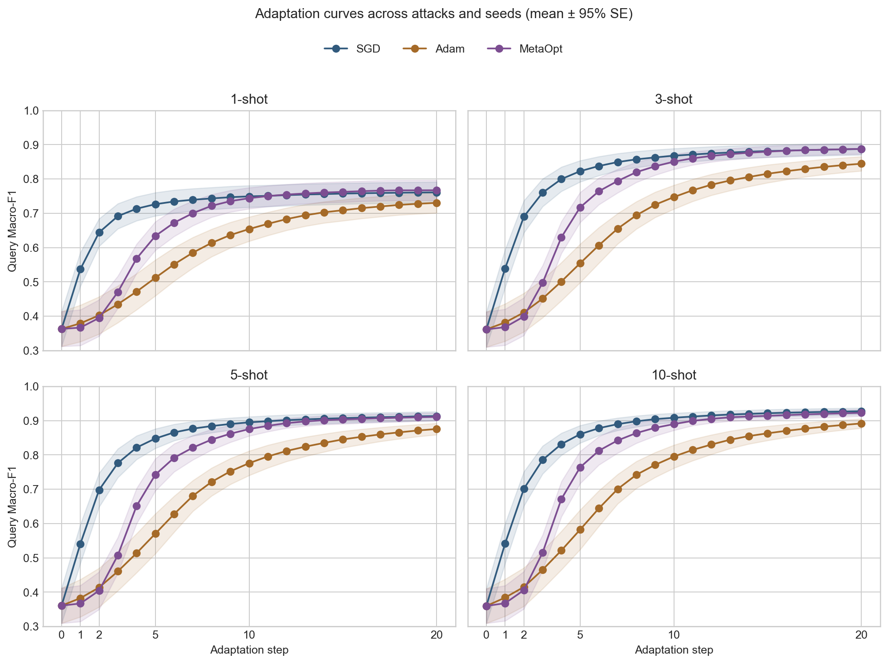
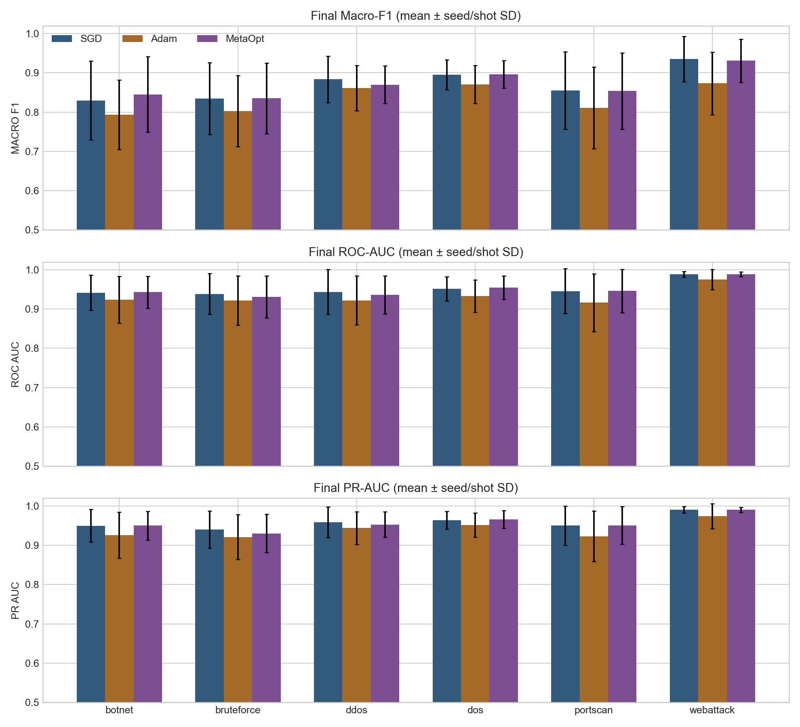
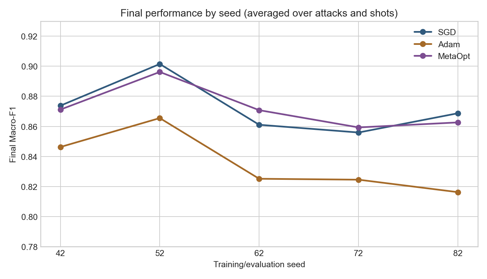
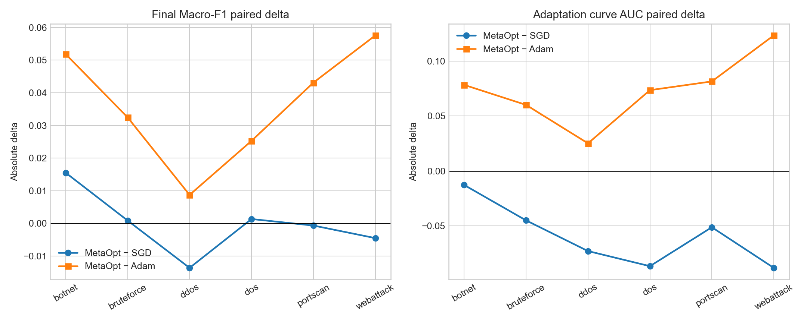
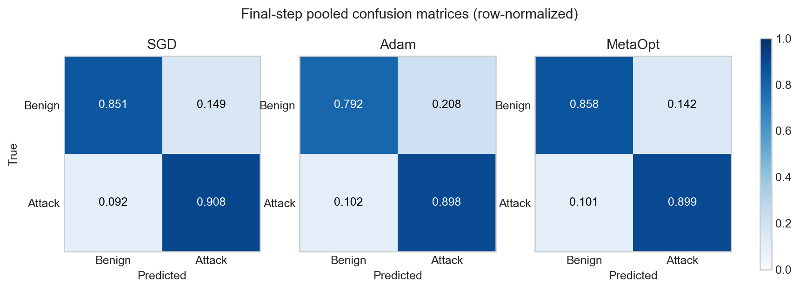
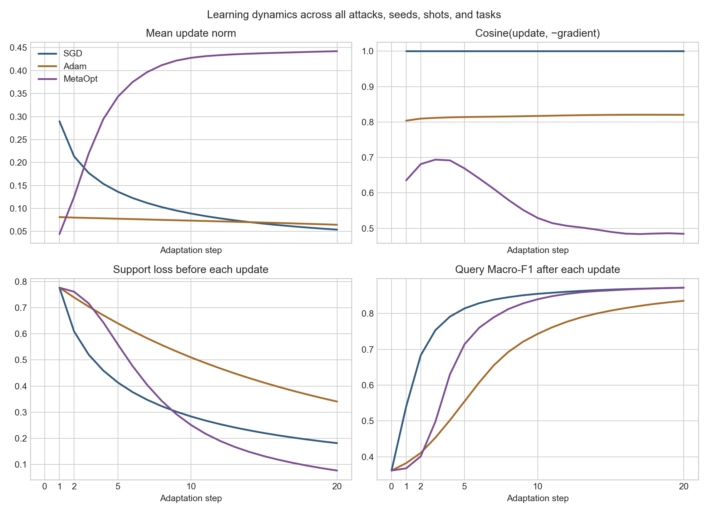
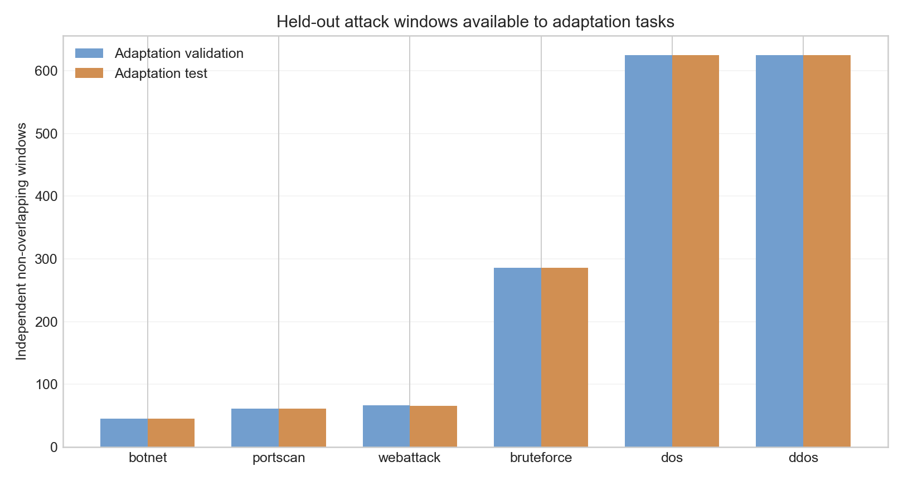

# 当前轮次 Meta-Learning 入侵检测实验审计

> 审计范围：仅当前仓库中的代码、配置、`logs/` 与其中的实验产物。  
> 审计日期：2026-07-23。  
> 主实验矩阵：`logs/outputs/fast_adaptation_matrix_20260722/`。  
> 复核脚本：`reports/audit_current_run.py`；机器可读回执：`reports/current_run_analysis_receipt.json`。

## 1. 执行摘要

### 结论

本轮主矩阵是**完整且具备分析价值**的：6 个未知攻击 × 5 个 seed × 4 个 shot × 3 个方法均有可追溯结果，30/30 个训练运行和 30/30 个评估运行完成；主矩阵 2,160 行、汇总 432 行，重算汇总与落盘汇总最大差异仅 `3.33e-16`。没有空文件、CSV/JSON 解析失败、重复主键、support/query 内容重叠、非有限数或 update clipping。

但当前结果**不能支持“LSTM Meta-Optimizer 比 SGD 更快适配”**：

- 第 1 步 Macro-F1：SGD `0.5398`，Adam `0.3820`，MetaOpt `0.3675`。MetaOpt 相对 SGD 低 `0.1723`。
- 20 步曲线面积（Macro-F1 curve AUC）：MetaOpt 相对 SGD 平均低 `0.0593`，在 120 个 attack×seed×shot 单元中为 `10/0/110`（win/tie/loss）。
- 第 20 步 Macro-F1：MetaOpt `0.8720`，SGD `0.8722`，二者几乎相同；MetaOpt 明显优于 Adam `0.8355`。
- 使用未知攻击 validation task 选择停止步时：MetaOpt `0.8702`、SGD `0.8695`，仍基本持平；MetaOpt 的平均选择步数通常在 15–19 步，而不是 1–5 步。

首要原因不是简单的“学习率不合适”或“训练不充分”，也没有证据支持更新符号、参数顺序、hidden-state 泄漏、clip 或 checkpoint 架构不匹配。当前证据最支持以下因果链：

> 元训练只在固定 20 步结束后计算一次 query loss，checkpoint 也由 20 步验证 F1 选择  
> → 纯 LSTM 坐标更新器从零 hidden state 开始，第一步输出很小且只部分对齐下降方向，随后 update norm 随 hidden state 累积持续放大  
> → 第 1 步 support loss 几乎不降，早期 query F1 显著落后 SGD  
> → 到第 10–20 步 MetaOpt 才快速压低 support loss，最终 F1 追平 SGD  
> → 它学到了“面向固定长 horizon 的慢启动调度器”，而不是快速适配器。

数据和协议进一步削弱了结论可信度：元训练只有约 5 个真正可采样的攻击家族；训练固定 5-shot，却评估 1/3/5/10-shot；botnet、portscan、webattack 的未知测试窗口分别只有 45、61、66 个，但每个 shot 重复采 100 个 task；编码器是未预训练且冻结的随机 LSTM，仅更新 66 个分类头参数。它们更可能放大泛化与稳定性问题，但**不足以单独解释** MetaOpt 的早期落后，因为 curve-AUC 缺口在样本充足的 DoS/DDoS 上同样明显。

### 证据状态总览

| 状态 | 结论 |
|---|---|
| 已确认 | 主矩阵完整；方法内共享同一 `theta0` 和同一批 test tasks；step 0 完全一致；更新方向接口正确；MetaOpt 早期更新过小、后期更新过大；训练只优化最终 20 步 query loss；训练/评估 shot 不匹配；低样本攻击 task 大量复用；Dummy 未纳入本轮；ROC 仅有最终标量、无逐步曲线；Adam 学习率落在搜索上界；训练曲线图被覆盖。 |
| 高概率、待消融 | 最终步目标导致 horizon-specific 慢启动策略；少量攻击任务和窗口复用导致 MetaOpt 对梯度时序过拟合；随机冻结编码器限制跨攻击泛化；Adam 搜索范围偏小。 |
| 当前无法判断 | Dummy 与 SGD 的运行时逐参数等价；本轮环境下元梯度逐层非零；checkpoint 文件与 `best.pt` 的张量哈希一致；MetaOpt 坐标更新是否塌缩为常数；原始数据在缓存生成后是否改变；跨 task 的精确窗口复用率；ROC 曲线与逐步 AUC。 |

## 2. 本轮实验完整性审计

### 2.1 目录与产物清单

用户描述的根目录 `outputs/` 当前不存在；全部结果位于 `logs/outputs/`，运行日志位于 `logs/logs/`。运行时日志记录的是 `outputs/...`，说明产物后来被整体移动或打包到 `logs/` 下。该问题影响路径可复现性，但不影响主矩阵内部统计一致性。

`logs/` 递归统计：

| 类型 | 数量 | 说明 |
|---|---:|---|
| 全部文件 | 1,184 | 合计 5,345,341,271 bytes |
| 空文件 | 0 | 未发现 |
| PNG | 601 | 每个主运行 20 张评估图，共 600；另有 1 张共享训练图 |
| CSV | 245 | 主运行明细、根级矩阵与汇总 |
| JSON | 155 | 配置、审计、结果、task pool |
| PT | 90 | 每运行 `meta_artifacts.pt`、`best.pt`、`last.pt` |
| LOG | 62 | 30 训练 + 30 评估 + 1 launcher + 1 独立部分日志 |
| TensorBoard event | 30 | 共享在 `logs/tensorboard/` |
| NPZ cache | 1 | CICIDS2017 清洗缓存，约 643 MB |

扩展名明细见 `reports/current_run_tables/artifact_type_counts.csv`。

### 2.2 主矩阵可追溯性

主矩阵包含：

- 未知攻击：botnet、bruteforce、ddos、dos、portscan、webattack；
- seed：42、52、62、72、82；
- shot：1、3、5、10；
- 方法：SGD、Adam、MetaOpt；
- 评估 checkpoint：0、1、2、5、10、20。

30 个运行目录均包含：

- 根级：`effective_config.json`、`meta_artifacts.pt`、`validation_task_pool.json`、`checkpoints/best.pt`、`checkpoints/last.pt`；
- 评估：`results.json`、`effective_config.json`、`task_level_results.csv`、`adaptation_curves.csv`、`fixed_budget_results.csv`、`step_diagnostics.csv`、`gradient_evolution.csv`、`update_analysis.csv`、`layer_update_distribution.csv`、重叠审计和数据审计；
- 20 张评估图：4 个 shot ×（3 个 confusion matrix + 1 个 F1 曲线 + 1 个速度柱图）。

每个运行的关键行数一致：

| 文件 | 每运行行数 |
|---|---:|
| `adaptation_curves.csv` | 25,200 |
| `fixed_budget_results.csv` | 72 |
| `gradient_evolution.csv` | 24,000 |
| `layer_update_distribution.csv` | 96,000 |
| `step_diagnostics.csv` | 25,200 |
| `support_query_overlap_audit.csv` | 520 |
| `task_level_results.csv` | 2,400 |
| `update_analysis.csv` | 120,000 |

根级 `matrix.csv` 的 2,160 行恰好等于 `30×4×3×6`；`summary.csv` 的 432 行等于 `6×4×3×6`，每行 `n_seeds=5`。重算均值/标准差后与 `summary.csv` 的最大数值差为 `3.33e-16`。完整运行映射见：

- `reports/current_run_tables/run_inventory.csv`
- `reports/current_run_tables/log_inventory.csv`
- `reports/current_run_tables/per_attack_method_seed_shot_final.csv`

日志证据：launcher 最终记录 “Fast-adaptation matrix complete”（`logs/logs/run_20260722_184159.log:417`）；30 个评估日志均在第 142 行记录结果落盘，例如 `logs/logs/run_20260722_184851.log:142`；训练完成和 artifact 路径可见 `logs/logs/run_20260722_184213.log:182-185`。

### 2.3 完成、失败、跳过和部分运行

| 类别 | 数量 | 判定 |
|---|---:|---|
| 主矩阵完整运行 | 30 | 正常完成 |
| 主矩阵失败 | 0 | 无 `Traceback`/`ERROR` |
| 攻击被跳过 | 2 | heartbleed：val/test 窗口 0/0；infiltration：1/1，低于需要的 20；见 launcher `:355-356` |
| 独立部分运行 | 1 | `run_20260722_183938.log` 到 DataBundle 构建后结束，无 artifact、无完成/错误标记；其架构为预检/独立运行，不计入主矩阵 |

### 2.4 异常与产物管理问题

1. **训练曲线被覆盖（已确认）**：30 个训练日志都写 `outputs/figures/meta_curves.png`，当前只保留一张 `logs/outputs/figures/meta_curves.png`。29 个运行的训练曲线不可恢复。
2. **TensorBoard 未按运行隔离（已确认）**：30 个 event 文件写在同一目录。没有覆盖，但浏览时容易混合不同 run。
3. **路径搬迁（已确认）**：日志/配置中的 `outputs/...` 与当前 `logs/outputs/...` 不一致。
4. **缓存来源路径陈旧（风险）**：cache key 保存 `E:\MetaLearning\datasets\CICIDS2017`，当前仓库在 `E:\Progect\MetaLearning`。缓存键只包含数据集名、数据根路径、标签映射和 schema，不包含原始文件 hash/mtime（`src/data/pipeline.py:104-117,168-171`）。本轮内缓存时间早于矩阵约 2 分钟，不能确认是旧缓存，但搬迁后无法证明原始数据内容一致。
5. **日志成功但结果未落盘**：主矩阵未发现；只有上述独立部分日志没有结果。

## 3. 实际实验协议

### 3.1 数据、清洗、切分与任务

实际生效参数以每个运行的 `effective_config.json` 为准，而不是只看 `configs/base.yaml`。共同协议：

| 项目 | 实际值 | 证据 |
|---|---|---|
| 数据集 | CICIDS2017，65 个特征 | effective config；launcher 数据审计 |
| 标签任务 | 二分类 `benign_vs_attack` | `binary_pair_mode`；`src/data/task_sampler.py:123-155` |
| 窗口 | temporal、last label、`window_size=16`、`stride=16` | effective config；launcher `:46-354` |
| 标准化 | 只在 meta-train 上 fit | `src/data/loao.py:209,252` |
| 单类上限 | 20,000 raw flows | effective config |
| 已知类切分 | 按类别时间顺序，约 60% meta-train / 20% eval / 20% test | `src/data/loao.py:121-166,246` |
| 未知类切分 | 全部从 meta-training 移除，再按时间二分为 adaptation validation/test | `src/data/pipeline.py:347-355` |
| 严格 test | `strict_adapt_test=true`，已知 test 使用独立 LOAO test | `src/data/pipeline.py:355-359` |
| support/query | 每类 K-shot support + 10 query；二类 query 共 20 | effective config；task sampler |
| 内容重叠 | support/query 和任务内部窗口禁止共享原始行 | `src/data/task_sampler.py:46-70,169-208` |
| 重叠审计 | 30 个运行共 15,600 条审计记录，overlap 均为 0 | 各运行 `support_query_overlap_audit.csv` |

未知攻击可用数据：

| 未知攻击 | raw rows | adaptation-val 窗口 | adaptation-test 窗口 |
|---|---:|---:|---:|
| botnet | 1,441 | 45 | 45 |
| portscan | 1,958 | 61 | 61 |
| webattack | 2,143 | 67 | 66 |
| bruteforce | 9,152 | 286 | 286 |
| dos | 20,000（截断） | 625 | 625 |
| ddos | 20,000（截断） | 625 | 625 |

每个 10-shot task 要使用 10 个未知 support 窗口和 10 个未知 query 窗口；100 个 test tasks 因而产生 2,000 次未知窗口使用。对 botnet 只有 45 个独立测试窗口，因此 task 间必然高度复用。当前只保存了逐 task 指标，没有保存 test task manifest/window IDs，无法计算精确复用率。

query 每类固定 10 个样本，是 50/50 平衡任务。因此：

- 当前 Accuracy 与 macro recall 数值相同是协议结果，不是实现错误；
- 原始 CICIDS2017 的类别不平衡不会直接改变每个 query 的类别占比；
- 但低样本类别会造成窗口复用、任务相关性和有效样本量远小于表面上的 100 tasks。

### 3.2 元训练协议

- 模型：单向 LSTM，hidden size 32、1 层、dropout 0，最后接 2 类线性头（`src/models/lstm.py:12-43`）。
- `head_only`：只更新 `classifier.weight` 和 `classifier.bias`，共 2 个 tensor、66 个参数；日志证据 `logs/logs/run_20260722_184213.log:48`。
- 编码器没有预训练；`theta0` 在元训练前保存，MetaTrainer 的外层 optimizer 只包含 MetaOpt 参数（`train_meta.py:76-102`；`src/trainer/meta_trainer.py:83`）。因此本轮是“冻结随机 LSTM 表征 + 学习如何更新随机线性头”。
- MetaOpt：2 层 coordinate-wise LSTM，hidden size 20；已经启用 log-sign gradient preprocessing（`preprocess=true, p=10`），`output_scale=0.05`，可学习全局缩放，per-tensor update norm clip=1。
- 元训练：固定 5-shot、query=10、每 epoch 100 tasks、meta-batch=4、最多 30 epochs，outer LR=`1e-3`，outer grad clip=1；二阶反传（`first_order=false`、`tbptt=0`）。
- 内循环 horizon 与评估一致，均为 20 步。
- **目标只在第 20 步计算一次 query CE**：`OuterLoop.run_meta_batch` 先完成全部 inner adaptation，再在 `theta_K` 上计算 query loss（`src/meta_learning/outer_loop.py:51-66`）；没有多步 query loss。
- checkpoint 由固定 known-attack validation tasks 的第 20 步 F1 选择；`train_meta.py:96-102` 加载 best MetaOpt state 再写入 `meta_artifacts.pt`。
- 名义 known list 包括除 held-out unknown 外的攻击，但 heartbleed/infiltration 窗口不足以构造 K+Q task，实际上每个 LOAO 运行只有约 5 个可采样攻击家族。类间采样是均匀选择攻击类别，不是按 raw 样本数加权。

### 3.3 评估协议与公平性表

| 方法 | 起点 `theta0` | 适配参数 | 每个 shot 的超参选择 | 更新规则 | 状态 | 本轮是否运行 |
|---|---|---|---|---|---|---|
| SGD | 同一 run 内共享 | 66 个分类头参数 | 30 个 unknown validation tasks，从 `[0.5,0.1,0.05,0.01]` 选 LR；再独立选 stop step | `theta <- theta - lr*g` | 无 | 是 |
| Adam | 同一 run 内共享 | 同上 | 从 `[0.01,0.005,0.001,0.0005]` 选 LR；再选 stop step | 标准 Adam delta | 一、二阶矩按 task 重置 | 是 |
| DummyMetaOptimizer | 代码上应同 SGD | 同上 | 应使用 SGD 选中的 LR | `delta=-lr*g`，走 MetaOpt 接口 | 空状态 | **否** |
| LSTM MetaOpt | 同一 run 内共享 | 同上 | 加载 known-task 验证最佳 checkpoint；unknown validation tasks 只选 stop step | `theta <- theta + learned_delta` | 每个 task 新建 2 层 hidden/cell | 是 |

公平性证据：

- `run_experiments.py:477-481` 先加载同一 `meta_init_state` 和 MetaOpt checkpoint；
- `:567-580` 每个 shot 只采一批 validation/test tasks；
- `:592-623` 把同一 `init_params` 和 `test_tasks` 传给三种方法；
- 三方法的 step 0 所有汇总指标完全一致；
- test support/query 内容重叠为 0。

限制：

1. 同一 run、shot 内方法是严格配对的；不同 shot 使用不同 task sampler seed 和不同 task 内容。
2. 不同训练 seed 的 `theta0`、数据采样和 task 都不同，因此“跨 seed 配对”是同一实验条件的配对，不是逐样本完全相同。
3. launcher 没有提供持久化 test task manifest；代码支持 manifest（`scripts/run_experiments.py:513-579`），但本轮未用。
4. SGD 在 120 个 run×shot 单元中 119 次选择 LR=0.5，Adam 120 次全部选择 0.01，均落在搜索上边界。基线搜索未确认覆盖最优点，尤其 Adam 可能被低估。
5. Dummy 未运行，缺少最重要的 MetaOpt 接口等价性证据。

### 3.4 step 定义、best step 与泄漏

- step 0：任何更新前评估；
- step 1：完成一次 support gradient/update 后评估；
- final：第 20 步；
- validation-selected：在 30 个 unknown validation tasks 上选 stop step，再在 100 个 test tasks 的该步报告；
- `best_f1_mean`：对**每个 test task 自己的整条 test trajectory 取最大值**，属于描述性 oracle 指标，存在 test peeking，不能作为论文主结果。

代码在更新后使用 `evaluate_params(step + 1)`，索引本身正确（`src/trainer/adapter.py:115,173-188`）。但速度计算传入的是去掉 step 0 的轨迹（`:135`），而 `compute_speed` 又以 1-based 计步（`src/evaluation/adaptation_speed.py:30-56`），所以 step 0 已达阈值的 task 被记为最少 1 步。本轮每方法约 25/12,000 个 task 受影响，比例 0.21%，不改变主要结论，但应修复定义。

逐步轨迹只保存 Accuracy、Precision、Recall、Macro/Weighted-F1、PR-AUC 和 attack recall；没有逐步 ROC-AUC（`src/trainer/adapter.py:59-108`）。最终 task-level 文件有 ROC-AUC，但没有 logits/probabilities，因此当前无法重画 ROC 曲线。

## 4. 结果统计与图表

### 4.1 全局最终性能

统计单元为 120 个 attack×seed×shot 的最终 task 均值。
代码中的 Precision、Recall 和 F1 均使用 macro averaging（`src/evaluation/metrics.py:75-78`）；二分类 ROC-AUC/PR-AUC 使用攻击类概率（`:85-86`）。

| 方法 | 指标 | mean | std | median | min | max |
|---|---|---:|---:|---:|---:|---:|
| SGD | Accuracy | 0.8793 | 0.0744 | 0.9003 | 0.6660 | 0.9840 |
| SGD | Precision | 0.8962 | 0.0640 | 0.9142 | 0.6898 | 0.9853 |
| SGD | Recall | 0.8793 | 0.0744 | 0.9003 | 0.6660 | 0.9840 |
| SGD | Macro-F1 | 0.8722 | 0.0847 | 0.8958 | 0.6202 | 0.9840 |
| SGD | ROC-AUC | 0.9517 | 0.0473 | 0.9677 | 0.7856 | 0.9974 |
| MetaOpt | Accuracy | 0.8786 | 0.0703 | 0.8987 | 0.6765 | 0.9835 |
| MetaOpt | Precision | 0.8954 | 0.0604 | 0.9114 | 0.7036 | 0.9849 |
| MetaOpt | Recall | 0.8786 | 0.0703 | 0.8987 | 0.6765 | 0.9835 |
| MetaOpt | Macro-F1 | 0.8720 | 0.0800 | 0.8968 | 0.6356 | 0.9834 |
| MetaOpt | ROC-AUC | 0.9501 | 0.0456 | 0.9660 | 0.7859 | 0.9978 |
| Adam | Accuracy | 0.8452 | 0.0745 | 0.8615 | 0.6270 | 0.9640 |
| Adam | Precision | 0.8690 | 0.0644 | 0.8823 | 0.6433 | 0.9677 |
| Adam | Recall | 0.8452 | 0.0745 | 0.8615 | 0.6270 | 0.9640 |
| Adam | Macro-F1 | 0.8355 | 0.0856 | 0.8566 | 0.5778 | 0.9639 |
| Adam | ROC-AUC | 0.9322 | 0.0589 | 0.9503 | 0.7225 | 0.9951 |

PR-AUC：SGD `0.9588±0.0404`、MetaOpt `0.9565±0.0395`、Adam `0.9398±0.0518`。attack recall：SGD `0.9076`、MetaOpt `0.8993`、Adam `0.8985`。FPR：SGD `0.1491`、MetaOpt `0.1420`、Adam `0.2081`。

完整 mean/std/median/min/max 见 `reports/current_run_tables/descriptive_stats_final.csv`。

### 4.2 按攻击的最终结果

| 未知攻击 | 方法 | Accuracy | Macro-F1 | ROC-AUC | PR-AUC | Attack recall | FPR |
|---|---|---:|---:|---:|---:|---:|---:|
| botnet | SGD | 0.8420 | 0.8299 | 0.9417 | 0.9497 | 0.9327 | 0.2486 |
|  | MetaOpt | 0.8560 | 0.8455 | 0.9431 | 0.9499 | 0.9323 | 0.2204 |
|  | Adam | 0.8091 | 0.7936 | 0.9239 | 0.9259 | 0.9384 | 0.3203 |
| bruteforce | SGD | 0.8459 | 0.8346 | 0.9387 | 0.9399 | 0.9328 | 0.2410 |
|  | MetaOpt | 0.8460 | 0.8355 | 0.9310 | 0.9300 | 0.9150 | 0.2230 |
|  | Adam | 0.8174 | 0.8030 | 0.9222 | 0.9211 | 0.9312 | 0.2964 |
| ddos | SGD | 0.8869 | 0.8835 | 0.9439 | 0.9587 | 0.8461 | 0.0723 |
|  | MetaOpt | 0.8739 | 0.8699 | 0.9366 | 0.9527 | 0.8028 | 0.0549 |
|  | Adam | 0.8654 | 0.8612 | 0.9220 | 0.9440 | 0.8120 | 0.0812 |
| dos | SGD | 0.8977 | 0.8950 | 0.9515 | 0.9640 | 0.8574 | 0.0620 |
|  | MetaOpt | 0.8986 | 0.8963 | 0.9546 | 0.9658 | 0.8762 | 0.0791 |
|  | Adam | 0.8742 | 0.8711 | 0.9333 | 0.9510 | 0.8549 | 0.1065 |
| portscan | SGD | 0.8635 | 0.8547 | 0.9457 | 0.9499 | 0.8930 | 0.1660 |
|  | MetaOpt | 0.8625 | 0.8541 | 0.9464 | 0.9507 | 0.8906 | 0.1657 |
|  | Adam | 0.8227 | 0.8110 | 0.9164 | 0.9228 | 0.8700 | 0.2245 |
| webattack | SGD | 0.9396 | 0.9353 | 0.9890 | 0.9905 | 0.9836 | 0.1044 |
|  | MetaOpt | 0.9348 | 0.9308 | 0.9886 | 0.9901 | 0.9788 | 0.1092 |
|  | Adam | 0.8826 | 0.8732 | 0.9755 | 0.9742 | 0.9846 | 0.2194 |

MetaOpt 的最终 Macro-F1 在 botnet、bruteforce、dos 略高于 SGD，在 ddos、portscan、webattack 略低；不存在一个攻击单独拖垮平均值。

### 4.3 按 shot、seed 和配对差值

最终 Macro-F1：

| shot | SGD | MetaOpt | Adam |
|---:|---:|---:|---:|
| 1 | 0.7610 | 0.7671 | 0.7304 |
| 3 | 0.8872 | 0.8875 | 0.8443 |
| 5 | 0.9132 | 0.9108 | 0.8755 |
| 10 | 0.9273 | 0.9227 | 0.8917 |

按 seed 平均后，MetaOpt 最终 Macro-F1 相对 SGD 的差值为：seed 42 `-0.0026`、52 `-0.0053`、62 `+0.0097`、72 `+0.0034`、82 `-0.0061`。因此最终性能不是由单一 seed 决定。

逐攻击、方法、seed 的 Accuracy/Precision/Recall/Macro-F1/ROC-AUC/PR-AUC/attack recall/FPR 在：

- `reports/current_run_tables/per_attack_method_seed_final.csv`（90 行，四个 shot 平均）
- `reports/current_run_tables/per_attack_method_seed_shot_final.csv`（360 行，保留 shot）

配对结果：

| 比较 | 粒度/阶段 | 平均 Macro-F1 差值 | win/tie/loss |
|---|---|---:|---:|
| MetaOpt − SGD | 12,000 个相同 test task，step 1 | -0.1723 | 786 / 2,056 / 9,158 |
| MetaOpt − SGD | 12,000 个相同 test task，step 20 | -0.0002 | 2,936 / 5,875 / 3,189 |
| MetaOpt − Adam | 相同 task，step 1 | -0.0145 | 849 / 8,003 / 3,148 |
| MetaOpt − Adam | 相同 task，step 20 | +0.0365 | 5,597 / 4,349 / 2,054 |
| MetaOpt − SGD | 120 个 seed×attack×shot，curve AUC | -0.0593 | 10 / 0 / 110 |
| MetaOpt − Adam | 同上，curve AUC | +0.0736 | 109 / 0 / 11 |

step 1 的 24 个 attack×shot 聚合单元中，MetaOpt−SGD 都为负且未校正 `p<0.05`；但每单元只有 5 个 seed，且 2,592 个检验没有多重比较校正，因此只能作为一致性证据，不能作为强显著性结论。

### 4.4 step 0、step 1、best、final

| 阶段 | SGD Macro-F1 | MetaOpt Macro-F1 | Adam Macro-F1 |
|---|---:|---:|---:|
| step 0 | 0.3614 | 0.3614 | 0.3614 |
| step 1 | 0.5398 | 0.3675 | 0.3820 |
| validation-selected | 0.8695 | 0.8702 | 0.8343 |
| step 20/final | 0.8722 | 0.8720 | 0.8355 |
| test-trajectory oracle best（仅描述） | 0.8887 | 0.9048 | 0.8506 |

MetaOpt 的 oracle best 看起来优于 SGD，但它在每条 test trajectory 上看答案选步，不能用于方法比较。全局 post-peak drop 很小，没有广泛“先好后坏”；真正模式是**早期几乎不动、后期追赶**。

### 4.5 类别偏置、混淆与 ROC

step 0 的预测攻击比例为 `0.7043`，attack recall `0.6218`、benign recall 约 `0.2131`，说明随机初始化对攻击类有明显预测偏置。最终全局归一化混淆：

| 方法 | benign recall | attack recall |
|---|---:|---:|
| SGD | 0.851 | 0.908 |
| MetaOpt | 0.858 | 0.899 |
| Adam | 0.792 | 0.898 |

没有出现“高 Accuracy 掩盖极低 attack recall”的总体假象；但 Adam 的高 FPR 明显拖累 Macro-F1。由于 query 平衡，Accuracy 不能反映真实部署先验，论文还需要按原始先验或独立自然流量测试。

最终 ROC-AUC 有标量统计，但未保存概率数组，**不能生成 ROC 曲线**。补充方式是在评估时按 task/step 落盘 logits、labels 或至少 ROC 点；同时将 `roc_auc` 加入 `metric_traj` 和矩阵 summary。

### 4.6 图表















## 5. MetaOpt 与基线的公平性检查

### 已通过

1. 同一 run/shot 内共享同一 `theta0`、validation tasks、test tasks。
2. 三方法 step 0 完全一致。
3. 适配范围相同：分类头 66 参数。
4. horizon 相同：20 步；评估没有超出训练 horizon。
5. support/query 无内容重叠。
6. checkpoint 可被严格 `load_state_dict` 加载并完成全部评估，排除了明显结构不匹配。
7. MetaOpt/Adam hidden 或 moment state 均按 task 初始化。

### 未通过或有保留

1. Dummy 未纳入，MetaOpt 接口尚无本轮运行时功能基准。
2. SGD/Adam LR 都落在搜索上界；Adam 基线尤其可能未调优。
3. MetaOpt checkpoint 用 known-task 最佳 F1 选择，而基线 LR 用 unknown validation task 选择；这是合理的 few-shot 评估，但二者可调自由度不同，应在论文中明确。
4. 每方法在 unknown validation 上选择 stop step，但 `best_f1_mean` 又在 test 上选 oracle 步；两者必须分开报告。
5. 不同 shot 没有固定 task manifest，shot 间比较同时改变了 task 内容。
6. 100 个 task 并不等于 100 个独立样本，低样本攻击存在严重伪重复。

## 6. MetaOpt 效果不佳的证据

### 6.1 实现正确性逐项审计

| 检查项 | 结论 | 证据 |
|---|---|---|
| 更新符号 | 未发现错误 | adapter 使用 `theta + update`（`src/trainer/adapter.py:182-188`）；SGD/Dummy 返回 `-lr*g`（`src/meta_optimizer/handcrafted.py:58-72`；`dummy.py:15-35`）；MetaOpt 平均 cosine(update, grad) 为负 |
| flatten/unflatten 顺序 | 未发现全局错位 | MetaOpt 按参数名逐 tensor flatten，输出 reshape 回原 shape，state 也按 name 保存（`lstm_optimizer.py:101-172`） |
| 梯度 detach | 评估 detach 正常；元训练未见错误 | 评估不需元梯度；训练 inner/outer 使用二阶图，query loss 经 `theta_K` 回传。正式 nonzero 测试本轮未运行 |
| hidden state | 无跨 task 污染 | 每 task `init_state`；评估每步 detach 但不重置（`adapter.py:171-194`） |
| 输入语义 | 当前只输入预处理梯度 | 没有 loss、parameter、previous update 输入；训练和评估一致 |
| gradient preprocessing | 已存在 | log-sign，`preprocess=true,p=10`；不能把“增加 log-sign”当作新修复 |
| clip | 不是原因 | 720,000 个 all-parameter step 记录中 clipping 率为 0 |
| checkpoint | 明显结构错误已排除 | 30 次 strict load 后评估完成；文件级张量 hash 未复核 |
| train/eval mode | 未见问题 | LSTMCell/linear 无 dropout/BN；评估显式 eval |
| step 偏移 | 指标曲线正确；速度有小偏差 | 指标 update 后记 `step+1`；speed 忽略 step0，影响约 0.21% task |
| Dummy==SGD | **无法判断** | 代码公式相同，但本轮 outputs 没有 Dummy |

### 6.2 学习动力学

| 方法/步 | grad norm | update norm | median update/grad | cosine(update, grad) | support loss（更新前） |
|---|---:|---:|---:|---:|---:|
| SGD step 1 | 0.5832 | 0.2897 | 0.500 | -1.000 | 0.777 |
| MetaOpt step 1 | 0.5832 | 0.0443 | 0.0688 | -0.615 | 0.777 |
| Adam step 1 | 0.5832 | 0.0812 | 0.1558 | -0.807 | 0.777 |
| SGD step 20 | 0.1099 | 0.0539 | 0.500 | -1.000 | 0.181 |
| MetaOpt step 20 | 0.0580 | 0.4422 | 11.87 | -0.472 | 0.076 |
| Adam step 20 | 0.2351 | 0.0646 | 0.2787 | -0.824 | 0.340 |

第一步 MetaOpt update norm 只有 SGD 的 `1/6.54`，方向也只部分对齐负梯度。更新 1 次后的 support loss：SGD `0.6094`、MetaOpt `0.7615`、Adam `0.7398`。到第 5 步：SGD `0.4135`、MetaOpt `0.5594`；第 10 步 MetaOpt 才降至 `0.2510`，第 20 步为 `0.0764`。

MetaOpt update norm 从 `0.044` 单调增长至 `0.442`，而梯度 norm 下降；median update/grad 从 `0.069` 增至 `11.87`。平均 ratio 后期被接近零的梯度放大，不能直接解释为发散；更可靠的 update norm、median ratio 和 support/query 指标共同表明它学到强烈的时序调度。无 clip、无 NaN，且 query F1 最终改善，因此不是数值爆炸。

当前日志没有每坐标 update、参数累计位移或 logits，无法判断更新是否塌缩为近似常数，也无法直接计算 MetaOpt update 与 `-lr*g` 的逐层余弦；已有 `cosine(update, grad)` 的负值等价说明整体方向偏下降。

### 6.3 元训练与评估不匹配

| 维度 | 训练 | 评估 | 判断 |
|---|---|---|---|
| horizon | 20 | 20 | 一致 |
| scope | head_only | head_only | 一致 |
| query/class | 10 | 10 | 一致 |
| shot | 固定 5 | 1/3/5/10 | **不一致** |
| 攻击 | 约 5 个已知攻击家族 | 1 个 held-out 攻击 | 分布外评估，设计预期但任务多样性弱 |
| 优化目标 | 仅 step 20 query loss | 强调 step 1/curve AUC/stop step | **目标错配** |
| 梯度尺度 | 固定 5-shot task | shot 改变梯度方差/尺度 | 不一致 |

即使只看 5-shot，MetaOpt curve AUC 仍为 `0.7807`，低于 SGD `0.8445`，所以 shot mismatch 不是唯一原因；但它会妨碍 1/3/10-shot 泛化。

### 6.4 数据和任务限制

- heartbleed/infiltration 根本不能构造独立未知评估，并且在元任务池中也基本不可用。
- botnet/portscan/webattack 的未知测试窗口只有 45/61/66；100 tasks 高度共享窗口。
- fixed meta-validation 中这些低样本类也只有约 18/24/26 个窗口，接近每 task 所需 15 个独立窗口。
- MetaOpt 的 curve-AUC 缺口并非只在低样本类：按攻击，MetaOpt/SGD curve AUC 分别为 botnet `0.7386/0.7513`、bruteforce `0.7203/0.7652`、ddos `0.7709/0.8437`、dos `0.7694/0.8559`、portscan `0.7355/0.7866`、webattack `0.7728/0.8608`。DoS/DDoS 数据充足，仍有大缺口。

因此，“数据少”是泛化与置信区间问题，但不是早期动力学失败的充分解释。

## 7. 根因分级

### 已确认的问题

1. **训练目标与“快速”指标错配**：只优化 step 20 query loss，并以 step 20 validation F1 选 checkpoint。
2. **MetaOpt 动力学慢启动**：第一步更新量过小、方向对齐度弱，随后 update norm 持续增大。
3. **固定 5-shot 训练、跨 shot 评估**。
4. **有效攻击任务仅约 5 类，低样本攻击 task 伪重复严重**。
5. **随机冻结编码器，仅适配 66 个头参数**。
6. **Dummy 功能基准缺失、Adam 网格触顶、test-oracle best 混入汇总、逐步 ROC 缺失**。

### 高概率但尚未验证

1. 最终步目标是慢启动时序的主要因果因素；需要多步 loss/随机 horizon 消融确认。
2. 纯 learned delta 缺少 SGD/Adam anchor，使第一步依赖 LSTM 隐状态积累；需要 residual/gate 消融。
3. 少量攻击类型和窗口复用使 MetaOpt 记忆训练攻击的梯度时序，而不是学习跨攻击通用更新。
4. Adam 的真实最优 LR 高于 0.01，当前 Adam 比较偏弱。
5. 学习一个更好的 `theta0` 或解冻少量 encoder 会比仅优化随机头更稳定。

### 当前无法判断

1. Dummy 与 SGD 的逐参数、逐 logit、逐指标误差是否在数值容差内。
2. 训练时 MetaOpt 每层元梯度是否稳定非零、是否集中在输出层。
3. learned update 在坐标维度上是否近似常数或只有少数坐标起作用。
4. cache 对应的原始文件内容是否与当前数据完全相同。
5. task 间内容级复用的准确比例。
6. ROC 曲线、逐步 ROC-AUC、校准误差和每步预测概率分布。
7. single-task overfit 能否成功；本轮没有相应诊断结果。

## 8. P0/P1/P2 优化路线

| 优先级 | 假设 | 当前证据 | 修改内容 | 最小验证实验 | 成功判据 | 风险 |
|---|---|---|---|---|---|---|
| P0 | MetaOpt 接口可能仍有隐蔽功能错误 | Dummy 未运行 | 加入 Dummy 与 SGD 同 LR、同 task、同 `theta0` 的逐步等价测试 | 1 个 artifact、1 个 5-shot task、20 步 | 参数/logits/update/指标最大差 `<1e-6` | 浮点设备差异需设容差 |
| P0 | 元梯度可能局部断裂 | 代码路径理论可回传，但无本轮测试 | 检查每个 MetaOpt 参数的 grad 非 None、finite、norm>0 | 单 task、2–3 inner steps、一次 backward | 输出层及 LSTM 各层都有有限非零 grad | 梯度很小不等于断裂 |
| P0 | checkpoint/scope 可能误配 | strict load 成功、scope 日志一致 | 对 artifact、best.pt、adapt names、config 做 hash/schema receipt | 任一 run | artifact MetaOpt state 与 best state hash 一致；2 tensor/66 params | checkpoint 包装格式不同 |
| P0 | step/speed 定义有偏移 | speed 忽略 step0 | 将 step0 纳入阈值判断；保留旧口径对照 | 对现有 logits/曲线重算 | step0 达标 task 记 0；其他不变 | 只影响少量 task |
| P1 | 最终步 loss 导致慢启动 | 强动力学证据 | 使用多步 query loss，如 `Σ w_t Lq(t)`，提高 t=1/2/5 权重 | ddos+botnet，seed 42/62，5-shot，固定 manifest | step1 对 SGD 差距从 -0.17 缩至 ≥-0.05；curve-AUC 差距 ≥-0.02；final 下降不超过 0.01 | 早期变好、最终变差 |
| P1 | 固定 horizon 让优化器记步数 | update norm 随步数强烈增长 | 训练时随机采 horizon 1–20，并对多个终点计算 query loss | 同上 | 1/5/10/20 步均无明显塌陷；selected step 中位数下降 ≥5 | 训练成本略增 |
| P1 | 纯 learned delta 第一更新缺少稳定锚点 | step1 update 小且 cosine 弱 | `delta=-αg + gate*residual`，residual 零初始化；加 update-norm trust region | 同一 artifact 设置，2 attacks×2 seeds | 第一步 cosine(update,grad) ≤-0.9；norm 为 SGD 的 0.3–1.0；最终不劣于当前 >0.01 | residual 退化为 SGD |
| P1 | 输出尺度/clip 搜索对象不对 | clip 从未触发，output scale 固定 | 独立搜索 residual scale/learned α/trust ratio，不优先调 outer LR | 只训练 4 个小配置，单 attack×2 seeds | 依据 validation curve-AUC 选；test 不重复选 | 小样本选择偏差 |
| P1 | shot 分布错配 | 训练固定5，评估4档 | meta-train 随机采 1/3/5/10-shot；对梯度做按 norm 或 batch-size 稳健归一化 | botnet+ddos，2 seeds | 四个 shot 的 curve-AUC 均不低于当前；shot1 step1 明显提升 | 任务构造成本增加 |
| P1 | task 多样性不足 | 仅约5类且窗口复用 | 保存固定 task manifest；优先按 capture/time block 构造 task，限制跨 task 窗口复用 | 每攻击 20–30 个去重 task，而非100重复 task | 独立块上的收益方向一致；有效样本量可报告 | task 数减少、方差增大 |
| P1 | Adam 基线被低估 | 120/120 选中0.01上界 | 扩展 Adam `[0.01,0.03,0.1,0.3]`，同 validation manifest 调参 | 1个攻击×2 seeds×5-shot | 最优 LR 不再卡边界；若仍卡边界继续扩展 | 大 LR 可能不稳定 |
| P2 | coordinate-wise LSTM 缺乏动量/组信息 | 当前只输入 gradient | 比较 Meta-AdaM、previous update、loss change、按 parameter group 的状态 | P1 最优协议下，2 attacks×3 seeds | curve-AUC 稳定高于 residual-SGD ≥0.01 | 参数更多、更易过拟合 |
| P2 | 随机冻结 encoder 是瓶颈 | 只更新随机头 | Meta-SGD/MAML 学习 `theta0`，或解冻最后 LSTM 层并分组更新 | 先1 attack×2 seeds | step0 表征改善且未知攻击 final/curve 均提升 | 计算/内存显著增加 |
| P2 | 纯 LSTM MetaOpt 不稳定 | 最终只追平SGD | 使用 SGD/Adam + learned gate/residual 作为主 learned-optimizer；同时保留 MAML/Meta-SGD 基线 | 6 attacks 前先2 attacks×3 seeds | 胜过调优 SGD 的 validation-selected 与 curve-AUC | 新方法不再是“纯”MetaOpt |
| P2 | 数据多样性仍不足 | 低样本攻击窗口少 | capture-aware 增强；GAN/VAE/对抗训练仅作为后续独立消融 | 先验证真实数据 protocol 后再做 | 真实独立 test block 提升，且无近邻泄漏 | 合成数据泄漏/模式复制 |

优先级说明：当前 MetaOpt 已启用 log-sign preprocessing，因此“加入 log-sign”不是修复项；可以对 `p`、per-tensor normalization 做消融，但优先级低于目标函数与 residual anchor。task-balanced sampling 目前在攻击类别层面已经近似均匀，真正问题是**独立内容不足**。

## 9. 最小消融实验矩阵

不启动完整 6×5×4 矩阵。先固定同一 task manifest，并选择一个样本充足攻击 ddos 和一个低样本攻击 botnet，以区分动力学问题与数据问题。

| 阶段 | 配置 | 攻击 | seed | shot | 训练预算 | 主要指标 |
|---|---|---|---|---|---|---|
| E0 | 当前实现复现 | ddos、botnet | 42、62 | 5 | 不重训/仅复评 | step1、curve-AUC、final |
| E1 | 多步 query loss | 同上 | 同上 | 5 | 当前 epoch 上限的 1/3，可 early stop | step1 gap、curve-AUC gap |
| E2 | 多步 loss + 随机 horizon | 同上 | 同上 | 5 | 同 E1 | 不同 checkpoint 稳定性 |
| E3 | SGD residual + learned gate/trust region | 同上 | 同上 | 5 | 同 E1 | update norm/cosine、step1 |
| E4 | E3 + mixed-shot training | 同上 | 同上 | 1/3/5/10 eval | 同 E1 | 跨 shot 曲线 |
| E5 | 调优 Adam 扩展网格 | ddos | 42、62 | 5 | 无元训练，仅评估 | 公平基线 |

统一成功判据：

1. 先通过 P0；否则不解释模型性能。
2. 相对当前 MetaOpt，step1 Macro-F1 至少提高 `0.08`；相对 SGD 的 step1 gap 缩至 `≥-0.05`。
3. MetaOpt−SGD curve-AUC gap 从 `-0.059` 缩至 `≥-0.02`。
4. final Macro-F1 相对当前 MetaOpt 下降不超过 `0.01`。
5. 两个攻击、两个 seed 的方向一致；无 nonfinite，clip ratio <5%，median update/grad 不随步数跨越两个数量级。
6. 所有模型只按 validation task 选配置/stop；test 只运行一次。

若 E1 成功，首因即为目标函数/horizon；若 E1 失败而 E3 成功，首因更接近纯 learned-delta 架构；若两者在 ddos 成功但 botnet 失败，数据多样性是关键交互因素；若 P0 失败，应停止所有方法改进。

## 10. 可直接在服务器执行的诊断命令

以下命令均是小规模诊断，不是正式矩阵。先在服务器原始输出布局下设置路径。

### 10.1 现有单元测试与元梯度

```powershell
python -m pytest tests/test_meta_gradient.py tests/test_protocol_fix.py tests/test_research_experiments.py -q
```

目的：检查元梯度、协议和 adaptation step 基础行为。预计 CPU < 2 分钟。成功：全部通过且无 skipped 的核心元梯度测试。

### 10.2 P0 Dummy≈SGD 与单任务诊断

```powershell
$ART = "outputs/fast_adaptation_matrix_20260722/runs/ddos/fraction_1/seed_42/horizon_20/meta_artifacts.pt"
$OUT = "outputs/diagnostics/p0_ddos_seed42"
python scripts/diagnose_metaopt_failure.py `
  --artifacts $ART `
  --out $OUT `
  --shot 5 `
  --p0_tasks 20 `
  --p0_val_tasks 10 `
  --p1_steps 1
```

目的：同 task、同 `theta0` 比较 Dummy/SGD/MetaOpt，并做最小 single-task 可训练性检查。预计单 GPU 2–5 分钟，CPU 5–15 分钟。成功：Dummy 与 SGD 所有逐步指标和 update trace 在 `1e-6` 内；MetaOpt 无 nonfinite。

### 10.3 扩大 Adam 网格的小诊断

```powershell
$ART = "outputs/fast_adaptation_matrix_20260722/runs/ddos/fraction_1/seed_42/horizon_20/meta_artifacts.pt"
$MANIFEST = "outputs/diagnostics/ddos_seed42_val_s5_manifest.json"
python scripts/generate_eval_task_manifest.py `
  --artifacts $ART `
  --out $MANIFEST `
  --shot 5 `
  --tasks 30 `
  --task-seed 1043 `
  --split val
python scripts/tune_adam_manifest.py `
  --artifacts $ART `
  --task-manifest $MANIFEST `
  --out outputs/diagnostics/ddos_seed42_adam_grid.json `
  --lrs 0.01,0.03,0.1,0.3 `
  --steps 20
```

目的：确认当前 Adam 上界是否过低。预计单 GPU < 5 分钟。成功：最优点不再处于网格边界；如果仍在边界，只扩一次网格，不跑全矩阵。

### 10.4 重新生成本报告统计

```powershell
python reports/audit_current_run.py
```

目的：只读解析现有 CSV/JSON 并重画报告图。预计 < 30 秒，不加载 PyTorch checkpoint。成功：回执显示 `run_count=30`、`complete_runs=30`、`duplicate_matrix_keys=0`、`summary_max_recompute_diff<1e-12`。

## 11. 当前结果能否用于论文

### 可以使用的部分

- 可作为完整、透明的**负结果/诊断结果**：LSTM MetaOpt 最终可追平 SGD、优于当前 Adam，但没有实现更快适配。
- 可以报告固定 checkpoint 的 step 0/1/2/5/10/20、完整 adaptation curve、validation-selected stop、配对差值和真实 n=5 seed 方差。
- 可以报告数据稀缺与任务复用限制，作为 validity threat。

### 目前不能支持的论文结论

- “MetaOpt 显著优于 SGD”；
- “MetaOpt 实现快速适配”；
- 以 test-trajectory `best_f1_mean` 作为主指标；
- 以 100 个高度复用的 tasks 当作 100 个独立重复；
- 声称已全面优于 Adam，因为 Adam 网格触顶；
- 展示 ROC curve，因为概率数据没有落盘。

### 论文前的最低门槛

1. P0 Dummy/SGD、元梯度、checkpoint/scope 三项通过。
2. 固定 task manifest，报告 task 的独立窗口/capture/time-block 信息。
3. 修正 speed step0 口径，去除 test oracle best 的主结果地位。
4. 扩展 Adam 网格，并加入 Meta-SGD/MAML 或 residual-SGD learned optimizer 基线。
5. 保存逐步 logits/labels，补齐 ROC-AUC、ROC 曲线、校准指标。
6. 对显著性检验做预注册指标选择和多重比较校正；不要把 n=5 的 2,592 个 p 值当作独立证据。
7. 将训练图、TensorBoard、配置、git commit、cache/raw-data hash 按 run 隔离保存。

## 12. 仍缺少的证据

1. **Dummy 运行结果**：本轮没有 Dummy 行，无法完成“Dummy==SGD”功能基准。
2. **本轮元梯度审计**：当前分析环境没有可用 PyTorch runtime，未直接加载 checkpoint 或运行 backward。
3. **checkpoint 内容哈希**：能够确认 strict load 成功，不能确认 `meta_artifacts.pt` 中 state 与 `best.pt` 字节/张量完全一致。
4. **test task manifest**：只保存了训练 validation pool，没有保存本轮 test task 的 window IDs，无法精确量化跨 task 重用。
5. **逐步 logits/probabilities**：缺少 ROC curve、逐步 ROC-AUC、Brier/ECE、每步类别概率分布。
6. **坐标级 update**：只有 norm、ratio、cosine 和层级汇总，无法判断坐标更新是否塌缩为常数或稀疏模式。
7. **参数累计位移**：未保存 `||theta_t-theta_0||`，只能由每步 update 间接判断。
8. **原始数据 provenance**：缓存没有原始文件 hash/mtime，且 cache key 路径与当前仓库路径不同。
9. **single-task overfit**：没有本轮诊断结果，不能区分“可训练但泛化差”和“局部也学不动”。
10. **自然部署先验测试**：所有 query 都是 50/50 平衡，不能推出真实网络流量上的 Precision/FPR。

---

### 复核附件

- 审计脚本：`reports/audit_current_run.py`
- 审计回执：`reports/current_run_analysis_receipt.json`
- 图像目录：`reports/current_run_figures/`
- 表格目录：`reports/current_run_tables/`
